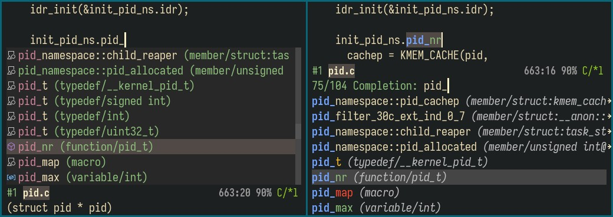

<p align="center">
  
</p>

<p align="center"><i>Ctags IDE on the True Editor!</i></p>

<p align="center">(Or, a superior code reading tool with pluggable
backends.)</p>

## What is it?

(If you are already familiar with Citre, see [changelog](CHANGELOG.md) for the
news.)

Citre started out as a tool utilizing tags files (in the ctags format). Now it
is a sophisticated code reading and auto-completion tool with pluggable backend
design. The built-in backends include:

- A tags file backend.
- A GNU global database backend.
- An xref adapter that transforms any xref backend into Citre backend.
- Eglot backend, based on the xref adapter.

The tools offered by Citre are:

- `completion-at-point`, xref and imenu integration.
- `citre-jump`: A `completing-read` UI for jumping to definition/references.
- `citre-peek`: A powerful code reading tool that lets you go down the rabbit
  hole without leaving current buffer.

Let's see them in action!

- `completion-at-point`, with the UI of
  [company](https://company-mode.github.io/) and
  [Vertico](https://github.com/minad/vertico):

  

  Notice the rich annotations. Candidates are annotated by `(kind/type@scope)`,
  so you know "it's a member of struct `thread`, with `pid_t` type", etc. This
  is because Ctags "tags" format records much more abundant info than the etags
  "TAGS" format.

  Also, notice that candidates with the "member" kind are put above the others
  because we are in a C source file, and the current symbol is after a dot.
  Citre guesses that you want a struct member.

- `citre-jump`, with `completing-read` UI provided by
  [Selectrum](https://github.com/raxod502/selectrum):

  

- `citre-peek`. It opens a "peek window" to show the definition of a symbol:

  

  And there's more. Notice the code reading history at the bottom of the peek
  window. Do you hate having to switch between a lot of buffers while reading
  code? With `citre-peek`, you can peek a symbol in the peek window. This
  allows a tree-like code reading history, that you can browse and edit,
  without leaving current buffer!

All above screenshots were taken in a huge project (the Linux kernel), using
the tags file backend, and Citre is still fast, because readtags performes
binary search on the tags file.

## Quick start

### Installation

You can install `citre` from [MELPA](https://melpa.org). Below are instructions
to install Citre manually.

1. Clone this repository:

   ```console
   $ git clone https://github.com/universal-ctags/citre.git /path/to/citre
   ```

2. Add the path to your `load-path` in your Emacs configuration:

   ```elisp
   (add-to-list 'load-path "/path/to/citre")
   ```

3. Require `citre` and `citre-config` in your configuration:

   ```elisp
   (require 'citre)
   (require 'citre-config)
   ```

   Or, you can read [citre-config.el](citre-config.el), and write your own
   config.

### Pick a backend

Here's a comparison of their capabilities:

| Backend | Auto-completion | Find definition | Find references | Imenu |
|---------|-----------------|-----------------|-----------------|-------|
| Tags    | ✓               | ✓               |                 | ✓     |
| Global  | ✓               | ✓               | ✓               | ✓     |
| Eglot   | [1]             | ✓[2]            | ✓[2]            |       |

[1]: Auto-completion is handled by eglot itself.

[2]: Eglot backend doesn't support finding definition or references for an
    user inputted symbol.

Pick a backend, and read its "getting started" documentation:

- Tags: [Getting Started on Tags
  Backend](docs/user-manual/getting-started-on-tags-backend.md)
- Global: [Use Global Backend](docs/user-manual/use-global-backend.md)
- Eglot: [Use Eglot Backend](docs/user-manual/use-eglot-backend.md)

You don't have to use only one. For example, you can use tags backend for
finding definitions, eglot backend for finding references with global backend
as a fallback. We'll show you how this works in the configuration section
later.

Below is a brief discussion of the backends. If you still don't have an idea
after reading it, I would recommended tags backend as it's fast, easy to use,
and fulfills most of the needs.

#### Tags

Tags file is a widely adopted text format for source code indexing. The best
tags file generating tool is [Universal
Ctags](https://github.com/universal-ctags/ctags). The advantages of the Citre
tags backend & Universal Ctags combination are:

- Supports many, many languages (157 by now!), and works great in a
  multi-language project. Many markup languages are also supported so you could
  even use it to browse your personal notes.
- The tags file contains abundant information, which enables a more informative
  UI, and Citre uses them to further filter and sort the tags found.
- Tags are sorted so we can use binary search, and you'll feel super fast when
  finding definitions/completions.

The disadvantages are:

- Is not as accurate as a language server. Think of it as a fuzzy finder.
- Doesn't support finding references for now.
- Tags file doesn't support incremental updating.

#### Global

This is based on [GNU Global](https://www.gnu.org/software/global/), another
source code indexing tool. Its advantages are:

- Supports finding references.
- Uses a compact binary database format, and supports incremental updating.

The disadvantages are:

- Not as accurate as a language server.
- Supports only 5 languages. But this can be saved by using Universal Ctags &
  pygments as plugin parsers.
- The database only contains brief information, so the UI and filtering is not
  as good as the tags backend.

#### Eglot

This is based on [Eglot](https://github.com/joaotavora/eglot), a language
server client now built into Emacs. Its advantages are:

- Finds definition/references accurately.

Its disadvantages are:

- You need to install a language server for each language you use.
- For dynamic languages, sometimes it may fail to find a definition/reference.
- Some language servers can be slow and heavy on CPU/memory.

### Use Citre

Use `citre-mode` to enable `completion-at-point`, xref and imenu integration.
If you also use `company`, make sure `company-capf` is in `company-backends`.

When you open a file, Citre asks the backends if they can work (like if the
tags backend cound find a tags file). If any of them can work, `citre-mode` is
automatically enabled. If you don't use `citre-config`, you can put this in
your configuration:

``` elisp
(add-hook 'find-file-hook #'citre-auto-enable-citre-mode)
```

Other tools provided by citre, `citre-jump` and `citre-peek`, doesn't need
`citre-mode` enabled to work. These are all `citre-jump` commands:

- `citre-jump` and `citre-jump-to-reference`: Jump to definition or references
  of symbol at point.
- `citre-query-jump` and `citre-query-jump-to-reference`: Jump to definition or
  references of a user inputted symbol. When called with a prefix argument, the
  identifiers in the project is used as completion for your input, if the
  backend supports it.

For `citre-peek`, see [Use Citre Peek](docs/user-manual/use-citre-peek.md) to
know how to use it.

### Configuration

Here's an example configuration using
[`use-package`](https://github.com/jwiegley/use-package). Be sure to tweak it
to your own need.

``` elisp
(use-package citre
  :defer t
  :init
  ;; This is needed in `:init' block for lazy load to work.
  (require 'citre-config)
  ;; Bind your frequently used commands.  Alternatively, you can define them
  ;; in `citre-mode-map' so you can only use them when `citre-mode' is enabled.
  (global-set-key (kbd "C-x c j") 'citre-jump)
  (global-set-key (kbd "C-x c J") 'citre-jump-back)
  (global-set-key (kbd "C-x c p") 'citre-ace-peek)
  (global-set-key (kbd "C-x c u") 'citre-update-this-tags-file)
  :config
  (setq
   ;; Set these if readtags/ctags is not in your PATH.
   citre-readtags-program "/path/to/readtags"
   citre-ctags-program "/path/to/ctags"
   ;; Set these if gtags/global is not in your PATH (and you want to use the
   ;; global backend)
   citre-gtags-program "/path/to/gtags"
   citre-global-program "/path/to/global"
   ;; Set this if you use project management plugin like projectile.  It's
   ;; used for things like displaying paths relatively, see its docstring.
   citre-project-root-function #'projectile-project-root
   ;; Set this if you want to always use one location to create a tags file.
   citre-default-create-tags-file-location 'global-cache
   ;; Read the tags backend manual to know about these.
   citre-use-project-root-when-creating-tags t
   citre-prompt-language-for-ctags-command t
   ;; If you only want the auto enabling citre-mode behavior to work for
   ;; certain modes (like `prog-mode'), set it like this.
   citre-auto-enable-citre-mode-modes '(prog-mode)))
```

These user options are for customizing enabled backends:

- `citre-completion-backends`
- `citre-find-definition-backends`
- `citre-find-reference-backends`
- `citre-tags-in-buffer-backends`
- `citre-identifier-list-backends`
- `citre-auto-enable-citre-mode-backends`

Each is a list that's tried in turn when Citre doing things. For example, when
finding definitions, backends in `citre-find-definition-backends` are tried in
turn until one succeeded. See their docstrings to learn more. Normally you
don't need to modify them.

## Documentations

- [User Manual](docs/user-manual/toc.md)
- [Developer Manual](docs/developer-manual/toc.md)
- [Wiki](https://github.com/universal-ctags/citre/wiki)

## FAQ

- Q: How to use Citre over TRAMP?

  A: I don't have a remote machine to test, so I can't guarantee Citre will
  work over TRAMP. But for now, tags and global backends seem to work over
  TRAMP if you've installed required executables (readtags, global) on the
  remote machine. If anything goes wrong, it shouldn't be hard to fix.

  For eglot backend, I've not tried. I think you need to make eglot works over
  TRAMP, and the eglot backend will just work.

- Q: Why does `xref-find-reference` prompts me for a symbol, rather than pick
  the symbol at point?

  A: By default, `xref-find-references` always prompts you to choose an
  identifier from a list. You could set `xref-prompt-for-identifier` to `nil`
  to make it use the symbol at point instead. See its docstring for more
  details.

- Q: What to do if Citre didn't grab the right symbol for me, e.g., I want to
  find the definition of `foo.bar`, but can only get `foo` or `bar`?

  A: For tags and global backends, you can select `foo.bar` first (by an active
  region), then find its definitions.

- Q: Why doesn't Citre support automatically update tags file?

  A: Citre uses both line number and a search pattern to locate a tag. When the
  file containing the tag is edited, Citre could still locate the tag using the
  search pattern. Citre even tries to locate the tag when the line containing
  the tag itself is edited.

  So, jumping to definition is still useable when the file is edited. There's
  no need to frequently update the tags file.

  You may ask "what if I add new definitions, or modify/delete existing ones?"
  The truth is, if your codebase is reasonably large that you have to index
  them by Ctags, then small edits won't cause much trouble. You can just
  update the tags file when needed.

- Q: Citre freezes Emacs when opening a file on Windows.
- A: I'm not 100% sure about the cause, but seems some anti-virus softwares
  consider the way Citre communicates with external programs to be suspicious
  (see [this
  report](https://github.com/universal-ctags/citre/issues/163#issuecomment-1893801573)).
  Try adding Emacs and the program Citre uses (readtags and global) to the
  whitelist and see if it's solved.

## Donation

If Citre makes you happy, please consider buying me (@AmaiKinono) a beer to
make me happy ;)

- by Alipay

  

- by Wechat Pay

  

- by [Buy me a coffee](https://www.buymeacoffee.com/amaikinono)
