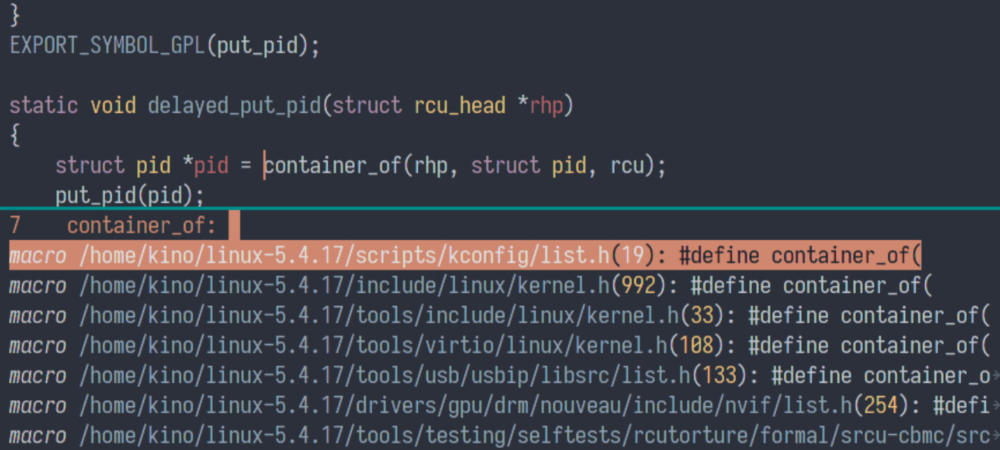
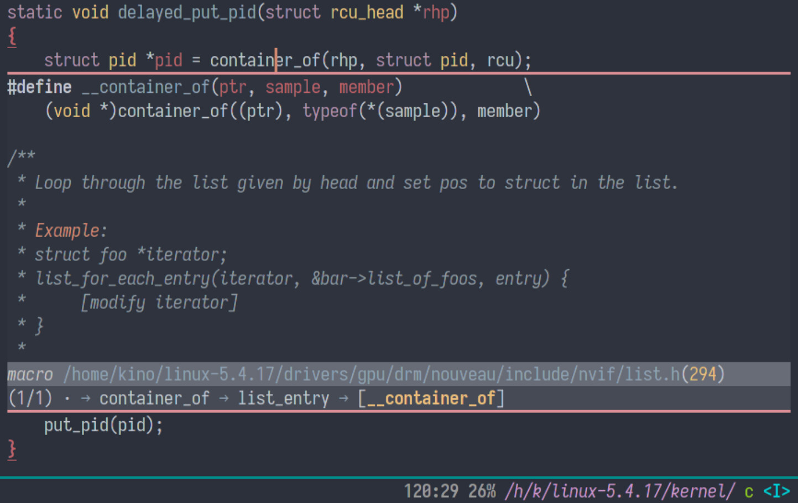

<p align="center">
  
</p>

<p align="center"><i>Ctags IDE on the True Editor!</i></p>

## What is it?

Citre is an advanced Ctags (or actually, readtags) frontend for Emacs. It
offers:

- `completion-at-point`, xref and imenu integration.
- `citre-jump`: A `completing-read` UI for jumping to definition.
- `citre-peek`: A powerful code reading tool that lets you go down the rabbit
  hole without leaving current buffer.

Let's see them in action!

- `completion-at-point`, with the UI of
  [company](https://company-mode.github.io/) and
  [Selectrum](https://github.com/raxod502/selectrum):

  

  Notice the candidates are annotated by `(kind/type)`. Candidates with the
  "member" kind are put above the others because we are in a C source file, and
  the current symbol is after a dot.

- `citre-jump`, with `completing-read` UI provided by
  [Selectrum](https://github.com/raxod502/selectrum):

  

- `citre-peek`. It opens a "peek window" to show the definition of a symbol:

  

  And there's more. Notice the code reading history at the bottom of the peek
  window. Do you hate having to switch between a lot of buffers while reading
  code? With `citre-peek`, you can peek a symbol in the peek window. This
  allows a tree-like code reading history, that you can browse and edit,
  without leaving current buffer!

All above screenshots were taken in a huge project (the Linux kernel), and
Citre is still fast, because readtags performes binary search on the tags file.

## Quick start

### Prerequisites

Citre requires readtags program provided by [Universal
Ctags](https://github.com/universal-ctags/ctags). The minimal version is:

- commit `31d13e85`, or
- weekly release p5.9.20200124.0

It's recommended to get the latest version, as Citre actively takes advantage
of its latest features. Also, the ctags program provided by Universal Ctags is
recommended for creating your tags file.

- For GNU/Linux users: If you install ctags from your software repository, run
  `$ ctags --version` to see if you are using Universal Ctags. The version is a
  little hard to inspect since Universal Ctags doesn't have a formal version
  number yet. If it's compiled before Jan 21 2021, it will probably not work.
  You can [build it
  yourself](https://github.com/universal-ctags/ctags#how-to-build-and-install),
  or try the [snap package](https://github.com/universal-ctags/ctags-snap).

- For macOS users: Follow the instructions
  [here](https://github.com/universal-ctags/homebrew-universal-ctags) to
  install the latest version.

- For Windows users: Download the binary
  [here](https://github.com/universal-ctags/ctags-win32). Ctags in cygwin (or
  msys repo of msys2) won't work since it doesn't come with readtags. Ctags in
  the mingw64 repo of msys2 is Universal Ctags, but by the time of writing, it
  doesn't meet the version requirement.

If you don't have readtags executable in your PATH, customize
`citre-readtags-program` to the path of it.

### Installation

1. Clone this repository:

   ```console
   $ git clone https://github.com/universal-ctags/citre.git /path/to/citre
   ```

2. Add the path to your `load-path` in your Emacs configuration:

   ```elisp
   (add-to-list 'load-path "/path/to/citre")
   ```

3. Require `citre` and `citre-config` in your configuration:

   ```elisp
   (require 'citre)
   (require 'citre-config)
   ```

   Or, you can read [citre-config.el](citre-config.el), and write your own
   config.

### Create tags file

Universal Ctags can generate very informative tags files, and Citre makes use
of it to provide better results. To generate an informative tags file, run this
in your project root:

```console
$ ctags --languages=c,c++,... --kinds-all='*' --fields='*' --extras='*' -R
```

See the [user manual](docs/user-manual/about-tags-file.md) to know more about
tags file format, and how to tweak the info included in a tags file.

### Use Citre

`citre-mode` is used to enable `completion-at-point`, xref and imenu
integration. If you also use `company`, make sure `company-capf` is in
`company-backends`.

By default, `citre-mode` is automatically enabled when you open a file, and a
tags file is found for it. If you don't use `citre-config`, you can put this in
your configuration:

``` elisp
(add-hook 'find-file-hook #'citre-auto-enable-citre-mode)
```

`citre-jump` and `citre-peek` works without `citre-mode`. Type `M-x citre-jump`
on a symbol to jump to its definition, `M-x citre-jump-back` to go back in the
jump history. About `citre-peek`, See [user
manual](docs/user-manual/citre-peek.md) to know how to use it.

Here's a example configuration using
[`use-package`](https://github.com/jwiegley/use-package). Be sure to read it
and tweak it to your own need.

``` elisp
(use-package citre
  :defer t
  :init
  ;; This is needed in `:init' block for lazy load to work.
  (require 'citre-config)
  ;; Bind your frequently used commands.
  (global-set-key (kbd "C-x c j") 'citre-jump)
  (global-set-key (kbd "C-x c J") 'citre-jump-back)
  (global-set-key (kbd "C-x c p") 'citre-ace-peek)
  :config
  (setq
   ;; Set this if readtags is not in your path.
   citre-readtags-program "/path/to/readtags"
   ;; Set this if you use project management plugin like projectile.  It's
   ;; only used to display paths relatively, and doesn't affect actual use.
   citre-project-root-function #'projectile-project-root))
```

See the [user manual](docs/user-manual/toc.md) to know more customizable
options.

## Manuals

- [User Manual](docs/user-manual/toc.md)
- [Developer Manual](docs/developer-manual/toc.md)

[This chapter](docs/developer-manual/design-principle.md) in the developer
manual talks about the strengths/weaknesses of ctags, and the design principle
of Citre. Non-developers are also encouraged to read it to know more about
these tools.

## Current status

Citre is in its alpha stage. The authors are still exploring the designing and
usage of the tools provided by Citre, so we may introduce some breaking
changes.

That said, I've put much effort polishing the tools, and have been using it
daily for a long time. Citre is useable, and offers great tools, so just try
it!
